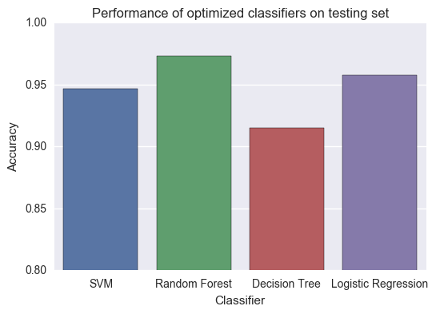

# Breast Cancer Classification 

Jupyter notebook that explores and optimizes classification models for breast cancer cells based on cell nuclei characteristics. 

Data from University of Wisconsin Breast Cancer Diagnostic <a href="https://archive.ics.uci.edu/ml/datasets/Breast+Cancer+Wisconsin+%28Diagnostic%29">dataset</a>

